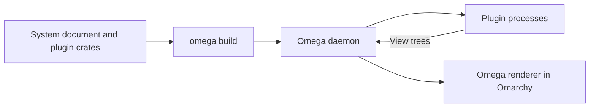

# Architecture

`omx` is a Cargo workspace that describes a desktop configuration and implements
its plugins. Omega builds and supervises those plugins; Omarchy hosts their bar
indicators and popup panels. Omega also hosts standalone surfaces, including
the launcher overlay.

This guide describes the code in this repository. Socket protocols, process
supervision, and renderer internals are documented in
[Omega's architecture guide](https://github.com/roushou/omega/blob/main/docs/architecture.md).

## Workspace structure

| Location                                            | Responsibility                                          |
| --------------------------------------------------- | ------------------------------------------------------- |
| [system/src/main.rs](../system/src/main.rs)         | Desired bar layout, placements, settings, and schedules |
| `plugins/<name>/`                                   | One plugin's views, state, and behavior                 |
| [crates/desktop-ui](../crates/desktop-ui/README.md) | Reusable panel layouts                                  |

[Cargo.toml](../Cargo.toml) discovers `plugins/*` and `crates/*` members.
Membership under `plugins/` declares a runnable plugin. A library is linked into
its consumers and never starts a process of its own.

Plugin crates expose a library target so `system` can refer to their surface and
settings types. Their binary entry points call the registered plugin's `run()`
method. The system crate constructs and emits a `Document`; it doesn't implement
a second plugin runtime.

## From configuration to the screen



`omega build` compiles plugins, queries their manifests, evaluates the system
document, and publishes a build. The daemon applies it, starts plugins, and
creates the configured surface instances. The renderer draws the view trees
published by those instances.

A placement pairs an indicator with an optional panel:

```rust
PluginWidget::new("network", network::Indicator)
    .settings(&network::Settings {
        show_ssid: true,
        ..Default::default()
    })
    .panel(network::Panel)
```

The first argument identifies the placement. The Rust types identify the surfaces.
Placement settings reach both surfaces. `system` chooses where they go in the bar;
the plugin chooses what they draw and how they respond to input.

The menu and tray are native Omarchy widgets. Workspaces has only an indicator,
because its buttons act directly. The other current plugins pair an indicator
with a panel.

The launcher uses the same `Panel` surface in its bar popup and standalone overlay.
`omega present launcher panel` creates a separate presentation; the compositor
keybinding invokes that command and is configured outside the system document.
Standalone presentations use Omega's renderer with the Omarchy theme adapter.

## Readings, state, and actions

There are three common sources of data in these plugins:

| Kind            | Example                                       | Owner                        |
| --------------- | --------------------------------------------- | ---------------------------- |
| Service reading | Volume, Wi-Fi connection, focused workspace   | Omega's platform services    |
| Panel model     | Calendar month, search query, selected player | One surface instance         |
| Shared record   | AI usage snapshot, launcher history           | The plugin that publishes it |

Surfaces implement Omega's `Surface` contract: a model, messages, effects, an
`update` method, and a `render` method. Stateless indicators use `()` as their
model and effects, with no local messages.

Rendering reads data and constructs a view. User input reaches either a registered
command or a surface message. Stateful panels update their local model and can
start effect tasks. The result returns as another message to that instance.

For example, the [network panel](../plugins/network/src/panel.rs) stores its
selected network, password field, and pending request locally. Connecting sends
a request through Omega's Wi-Fi control API. Completion clears the pending state;
the Wi-Fi reading determines whether a connection was established.

Simpler controls use commands. [Audio](../plugins/audio/src/lib.rs) registers
volume and mute commands that can be called from a button or `omega run`.
Workspaces sends a typed destination to the compositor and displays focus from
the subsequent reading, including changes made through global shortcuts.

## Instance lifetime

One plugin process can serve several surface instances. Each panel has its own
model: selecting a media player in one panel doesn't change another panel's
selection. Shared service readings still describe the same desktop.

Hiding a panel and destroying its instance are different operations. A hidden
panel can retain a pending request; destroying an instance ends its local state
and task delivery. Neither operation reverses an external action already accepted
by a service.

Panels handle reopening according to their purpose. The clock returns to the
current month, while the launcher resets its query. Network and launcher code
also track which opening started a request so a late result doesn't overwrite a
new interaction. Plugin restart ends its current instances.

## Launcher state

The [launcher](../plugins/launcher/README.md) reads Omega's shared application
catalogue. Each panel keeps its query, selection, and pending launch in its own
model. Search ranks literal and fuzzy matches; with an empty query, favorites
come first, followed by recent apps and alphabetical results.

[History](../plugins/launcher/src/history.rs) holds favorite desktop IDs and the
20 most recently admitted launches. Effects publish changes through
`Own<History>`; panels read them through `Watch<History>`. Bar and standalone
instances therefore share history without sharing their current search.

These records live in the daemon. They survive plugin restarts but disappear when
the daemon restarts. There is no history file. Successful launch admission adds a
recent entry; it does not prove the application finished starting. After recording
the launch, the panel requests dismissal only if it is still the same opening.

## AI usage collection

[AI usage](../plugins/ai-usage/README.md) collects data outside Omega's platform
services. Its worker runs Omarchy's collectors and reads their JSON output files.

```text
Omarchy collectors -> JSON records -> Source cache -> Snapshot -> Indicator / Panel
```

[Source](../plugins/ai-usage/src/source.rs) owns one worker per plugin process,
refresh admission, cached records, and retry timing. The system document invokes
`Poll` every five seconds. `Poll` publishes changed snapshots through `Own<Snapshot>`;
the surfaces read the same record through `Watch<Snapshot>`.

The five-second schedule publishes progress. Collection itself runs every
15 minutes, with manual refresh and failure retries. This avoids starting a
collector for every panel or monitor. The worker's memory is process-local;
the collector files provide cached data after a restart.

Provider selection stays in each panel model. Rendering doesn't read files or
run the collector, so preview cases can supply synthetic snapshots directly.

## Shared UI components

[desktop-ui](../crates/desktop-ui/README.md) contains headings, sections,
detail rows, and labelled controls. Components accept views, values, and action
bindings. They don't fetch readings, decide device policy, or own panel models.

A plugin decides how to handle an unavailable reading before passing values to a
component. It also chooses panel width and placement-specific styling. This lets
the same detail row hold text in one panel and a control in another.

Passing a component into a container creates a component scope. Stable keys keep
repeated controls distinct. Calling `.render()` embeds the view without an extra
scope; use it when existing control or navigation keys need to remain unchanged.

## Tests and previews

Tests exercise calculations and state changes directly, then use `SurfaceHarness`
for surface interactions. Fixtures provide service readings and captured effects,
so tests don't need live hardware or a running daemon.

Preview cases are registered in each plugin's `previews::preview` library test.
They use the same surface implementation with supplied data. The
[network previews](../plugins/network/src/previews.rs), for example, cover the
normal panel, password entry, VPN status, and missing readings.

Keep configuration composition in `system`, plugin behavior in `plugins`, and
shared layouts in `desktop-ui`. Changes to general service APIs or renderer
behavior belong in Omega. See [Contributing](../CONTRIBUTING.md) for the development
workflow and checks.
