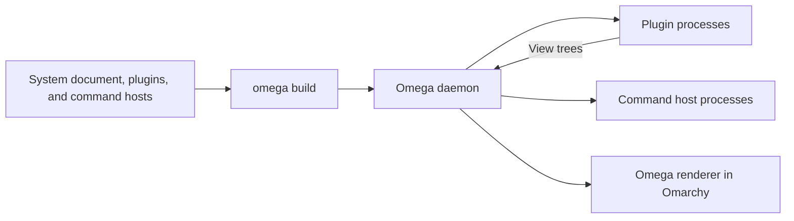

# Architecture

`omx` is a Cargo workspace that describes a desktop configuration and implements
its plugins. Omega builds and supervises those plugins; Omarchy hosts their bar
indicators and popup panels. Omega also hosts standalone surfaces, including
the launcher overlay.

This guide describes the code in this repository. Socket protocols, process
supervision, and renderer internals are documented in
[Omega's architecture guide](https://github.com/roushou/omega/blob/main/docs/architecture.md).

## Workspace structure

| Location                                    | Responsibility                                          |
| ------------------------------------------- | ------------------------------------------------------- |
| [system/src/main.rs](../system/src/main.rs) | Desired bar layout, placements, settings, and schedules |
| `commands/<domain>/`                        | Reusable command types and persistent host binaries     |
| `plugins/<name>/`                           | One plugin's views, state, and behavior                 |
| `crates/typesafe`                           | Semantic-search client                                  |

[Cargo.toml](../Cargo.toml) discovers `plugins/*`, `commands/*`, and `crates/*` members.
Membership under `plugins/` declares a runnable plugin. A library is linked into
its consumers and never starts a process of its own. Command crates also expose
a binary, marked with `package.metadata.omega.kind = "command-host"`. The system
document registers each host explicitly; importing its library does not start it.

Plugin crates expose a library target so `system` can refer to their surface and
settings types. Their binary entry points call the registered plugin's `run()`
method. The system crate constructs and emits a `Document`; it doesn't implement
a second plugin runtime.

## From configuration to the screen



`omega build` compiles plugins and command hosts, queries their manifests,
evaluates the system document, and publishes a build. The daemon applies it,
starts plugins, and creates the configured surface instances. Command hosts in
this configuration start on their first invocation. The renderer draws the view trees
published by those instances.

A placement pairs an indicator with an optional panel:

```rust
PluginWidget::new("network", network::Indicator)
    .settings(&network::Settings {
        show_ssid: true,
        ..Default::default()
    })
    .panel(network::Panel)
```

The first argument identifies the placement. The Rust types identify the surfaces.
Placement settings reach both surfaces. `system` chooses where they go in the bar;
the plugin chooses what they draw and how they respond to input.

The menu and tray are native Omarchy widgets. Workspaces has only an indicator,
because its buttons act directly. The other current plugins pair an indicator
with a panel.

The launcher uses the same `Panel` surface in its bar popup and standalone overlay.
`omega present launcher panel` creates a separate presentation; the compositor
keybinding invokes that command and is configured outside the system document.
Standalone presentations use Omega's renderer with the Omarchy theme adapter.

## Readings, state, and actions

The plugins use these sources of data:

| Kind               | Example                                       | Owner                              |
| ------------------ | --------------------------------------------- | ---------------------------------- |
| Service reading    | Volume, Wi-Fi connection, focused workspace   | Omega's platform services          |
| Panel model        | Calendar month, search query, selected player | One surface instance               |
| Shared record      | AI usage snapshot                             | The command host that publishes it |
| Persistent storage | Launcher favorites                            | Omega's storage service            |

Surfaces implement Omega's `Surface` contract: a model, messages, effects, an
`update` method, and a `render` method. Stateless indicators use `()` as their
model and effects, with no local messages.

Rendering reads data and constructs a view. User input reaches either a registered
command or a surface message. Stateful panels update their local model and can
start effect tasks. The result returns as another message to that instance.

For example, the [network panel](../plugins/network/src/panel.rs) stores its
selected network, password field, and pending request locally. Connecting sends
a request through Omega's Wi-Fi control API. Completion clears the pending state;
the Wi-Fi reading determines whether a connection was established.

Simpler controls call commands. [Audio commands](../commands/audio/src/commands.rs)
run in a persistent host shared by the audio panel, launcher, and `omega run`.
The UI declares typed `Caller<T>` dependencies; Omega routes each call to its host.
The host starts on the first call and stays running until stopped or replaced.
Native service connections remain shared through the daemon. See
[command hosts](../commands/README.md) for the registration pattern.
Workspaces sends a typed destination to the compositor and displays focus from
the subsequent reading, including changes made through global shortcuts.

## Instance lifetime

One plugin process can serve several surface instances. Each panel has its own
model: selecting a media player in one panel doesn't change another panel's
selection. Shared service readings still describe the same desktop.

Hiding a panel and destroying its instance are different operations. A hidden
panel can retain a pending request; destroying an instance ends its local state
and task delivery. Neither operation reverses an external action already accepted
by a service.

Panels handle reopening according to their purpose. The clock returns to the
current month, while the launcher resets its query. Network and launcher code
also track which opening started a request so a late result doesn't overwrite a
new interaction. Plugin restart ends its current instances.

## Launcher state

The [launcher](../plugins/launcher/README.md) reads Omega's shared application
catalogue. Each panel keeps its query, selection, and pending launch in its own
model. Search ranks literal and fuzzy matches; with an empty query, favorites
come first. Favorites and the remaining applications are each sorted
alphabetically. Search relevance takes precedence when the query is nonempty.

[Favorites](../plugins/launcher/src/favorites.rs) declares a persistent JSON
store keyed by typed application IDs, with a unit value for each favorite.
`Store<Favorites>` inserts or removes individual entries;
`Subscribed<AllFavorites>` supplies each panel's current snapshot. The subscription
covers the store's 32-entry limit, so every favorite participates in ranking.

Favorites survive plugin and daemon restarts. Loading and failed snapshots are
visible in the panel, and favorite controls stay disabled until storage is ready.
Search and launching remain usable without storage. A successful launch requests
dismissal only if the panel is still in the same opening. Launches do not write
to storage; acceptance does not prove the application finished starting.

## AI usage collection

[AI usage](../plugins/ai-usage/README.md) collects data outside Omega's platform
services. Its worker runs Omarchy's collectors and reads their JSON output files.

```text
Omarchy collectors -> JSON records -> Source cache -> Snapshot -> Indicator / Panel
```

[Source](../commands/ai-usage/src/source.rs) owns one worker in the AI command host,
refresh admission, cached records, and retry timing. The system document invokes
`Poll` every five seconds. `Poll` publishes changed snapshots through `Own<Snapshot>`;
the surfaces read the same record through `Watch<Snapshot>`.

The five-second schedule publishes progress. Collection itself runs every
15 minutes, with manual refresh and failure retries. This avoids starting a
collector for every panel or monitor. The worker's memory is process-local;
the collector files provide cached data after a restart.

Provider selection stays in each panel model. Rendering doesn't read files or
run the collector, so preview cases can supply synthetic snapshots directly.

## Shared UI components

`omega::ui::content` provides headings, sections,
detail rows, and labelled controls. Components accept views, values, and action
bindings. They don't fetch readings, decide device policy, or own panel models.

A plugin decides how to handle an unavailable reading before passing values to a
component. It also chooses panel width and placement-specific styling. This lets
the same detail row hold text in one panel and a control in another.

Passing a component into a container creates a component scope. Stable keys keep
repeated controls distinct. Calling `.render()` embeds the view without an extra
scope; use it when existing control or navigation keys need to remain unchanged.

## Tests and previews

Tests exercise calculations and state changes directly, then use `SurfaceHarness`
for surface interactions. Fixtures provide service readings and captured effects,
so tests don't need live hardware or a running daemon.

Preview cases are registered in each plugin's `previews::preview` library test.
They use the same surface implementation with supplied data. The
[network previews](../plugins/network/src/previews.rs), for example, cover the
normal panel, password entry, VPN status, and missing readings.

Keep configuration composition in `system`, plugin behavior in `plugins`, and
shared layouts in `omega::ui::content`. Changes to general service APIs or renderer
behavior belong in Omega. See [Contributing](../CONTRIBUTING.md) for the development
workflow and checks.
